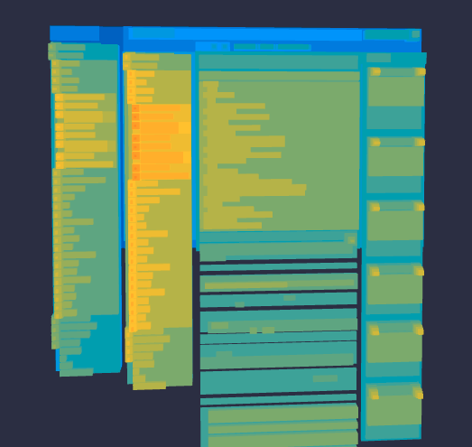

# SimpleDom3DView

### usage:

```js
var script = document.createElement('script')
script.src = 'https://img.youthol.top/Dom3DView.js?ver=' + Math.random();
document.body.appendChild(script);
```

### screenshot

